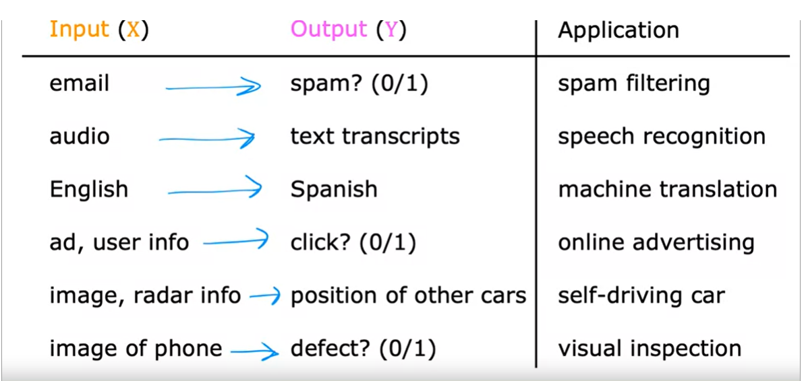

# Important  concepts

## references

## What is machine learning
### Arthur Samuel
Field of study that gives computers ability to learn without explicitly programmed.

## Types of ML
### Supervised machine learning
99% of the value in ML is created by supervised ML.  

